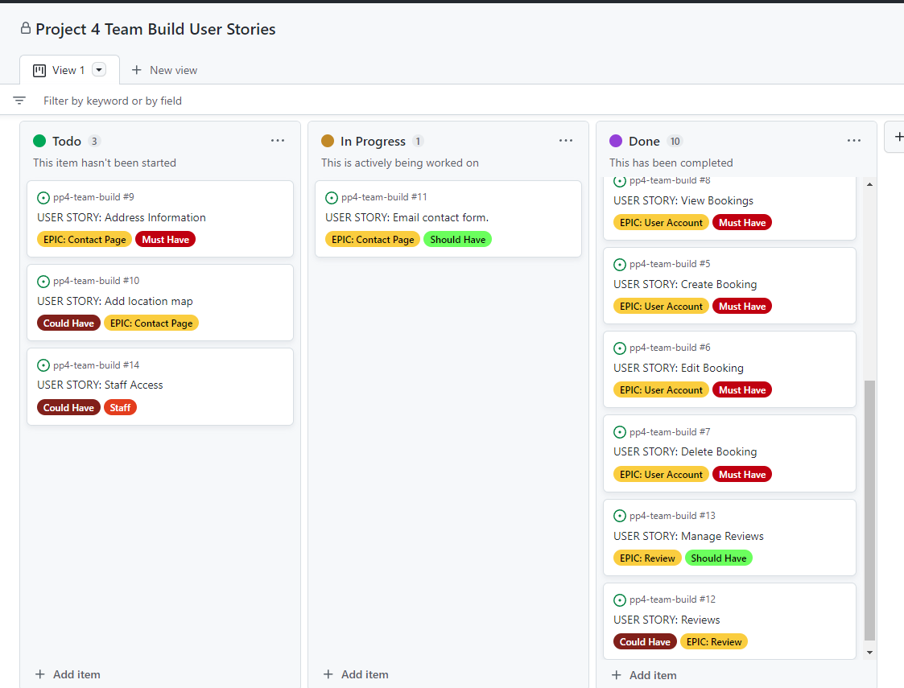
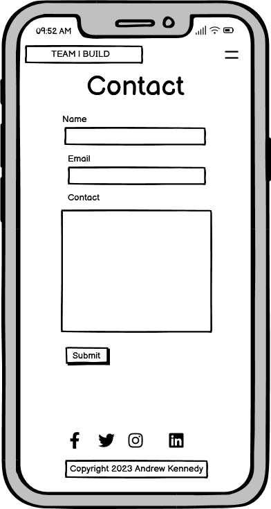
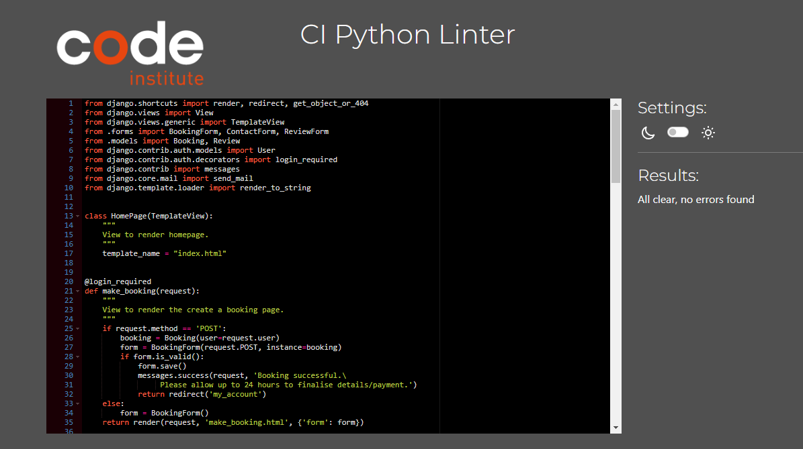

## [Table of Contents](#table-of-contents)
* [Purpose](#purpose)
* [User Experience Design (UX)](#user-experience-design)
* [User stories](#user-stories)
  * [Site Users](#site-users)
  * [Returning Visitor Goals](#returning-visitor-goals)
  * [Frequent Visitor Goals](#frequent-visitor-goals)
* [Agile Methodology](#agile-methodology)     
* [Design](#design)
  * [Wireframes](#wireframes)
  * [Colour Scheme](#color-scheme)
  * [Typography](#typography)
* [Structure](#structure)
  * [Logic](#logic)
* [Features](#features)
  * [Home Page](#home-page)
  * [Navigation](#navigation)
  * [Footer](#footer)
  * [Login/Logout/Register](#login-logout-register)  
  * [Make Booking](#make-booking)
  * [Delete Booking](#delete-booking)
  * [Edit Booking](#edit-booking)
  * [View Booking](#view-booking)
  * [Contact](#contact)
  * [Make Review](#make-review)
  * [View Review](#view-review)
  * [Administration](#administration)
* [Technologies Used](#technologies-used)
* [Libraries](#libraries)
* [Security and Authentification](#security-and-authentification)
* [Testing](#testing)
  * [Manual Testing](#manual-testing)
    
* [Bugs](#bugs)
* [Credits](#credits)
* [Deployment](#deployment)
* [Credits](#credits)
   * [Code and Tutorials](#code-and-tutorials)
* [Acknoledgements](#acknowledgements)   
    

# TEAM | BUILD BOOKING SITE
## Purpose:
### Goal:
#### To allow individuals and organisations a place to book a 'Team Building' exercise for themselves and their organisation.
#### To provide a visual and interactive that the user will be able to fulfil their objectives.
This is a booking application for 'Team Building' exercises. It is a site where you and your team can book a day on one of the various team building activities. 
The company will then confirm your booking or call to get additional details and arrange payment.
The application was created with a real need in mind.

### Business Goals:

The main goal of this project is to give a user the ability to make bookings. User should also should also be able to make updates to their account in via their account.

### Target Audience:

The target audience are organisations who have group/groups that they feel would benefit from taking time out and learning to work in collaboration to solve various challenges.

* [Back to contents](#table-of-contents)

The live website can be found [here](https://andyk8872.github.io/project-2/).

## TEAM | BUILD  Responsive Website View

* [Back to contents](#table-of-contents)
*** 
## User Experience Design

### User stories
#### Site Users
* As a First Time user, I want to easily understand the main purpose of the site.
* As a first time user, I want to be able to play the game and participate in the experience.
* As a First Time user, I want to view the website and content clearly on my mobile device.
* As a Firt Time user, I want to find to be able to contact the site owners.
* As a user I can have the ability to request a callback before the visit so that I can give more information and receive information.
* As a user I can cancel my booking if I don't need it anymore.
* As a user I can edit my booking so that I can change time or give more information.
* As a user I can create an account so that I can see my bookings.
* As a user I can have confirmation checks in relation to deletion of my bookings.
* As a user I can see the various activity options to choose from.
#### Returning Visitor Goals
* As a Returning user, I want to enjoy the experience and the interactive options .
* As a Returning user, I want to contact the site owners so I can share my experience.
#### Frequent Visitor Goals
* As a Frequent user, I want to check to see if there are any changes.
* As a Frequent user, I want to check to see if there are any new updates.
#### Staff Memmber
* As a admin I can see what times have been booked so that I can plan my work.
* As a admin I can have contact details in relation to the customer.
* As a admin I can have the ability to confirm bookings.

* [Back to contents](#table-of-contents)
***

## Agile Methodology

### Github Project Board

* Although not specially designed for this the project board in github works well enabling me to track my user stories.
* This enabled me to manage the project by breaking it up into several phases.
* Once the project had started it allowed me to cycle through the process to planning, executing and evaluating.
* The framework used is the Kanban board - a form of visual project management.
* There was the possibility of having a staff frontend user access. This was was later decided not to be a viable option due to time constraints. 

### Project Board/User Stories:

Kanban Board:

 

* [Back to contents](#table-of-contents)

User Stories:

 

* [Back to contents](#table-of-contents)
***
## Design
### Wireframes:

Desktop-Wireframes
 
* This is the 'home page' design in the desktop. 
 
* This is the 'contact page' design in the desktop. 
 
* This is the 'form' design. 
 
* This is the 'reviews/my-bookings' design. 
 

Mobile-Wireframes

* This is the 'home page' design in the mobile. 
 
* This is the 'contact page' design in the desktop. 

### Color Scheme:
The colors were chosen to complement each other as well as provide accessiblity. 
 

### Typography:
The Indie Flower and the Inknut Antiqua font are used throughout..

* [Back to contents](#table-of-contents)
***

## Structure
### Logic/ERD (diagrams)
* The logic and the relationships within the database can be seen in the diagram below.
 

* [Back to contents](#table-of-contents)
***

## Features

### Home Page
* The Home Page describes the site as a booking site and shows the three workshop challenges on offer.
 
***

### Navigation
* The Navigation bar gives the user the options/links in order to navigate the site and who is logged on if anyone.. 
 

***
### Footer
* The footer consists of two parts.
1. The social media links.
2. The copyright (using javascript for the current year) and a link to my Github page.
  

* [Back to contents](#table-of-contents)
***
### Login Logout Register
* The user can login, login and register with the site here. 
 
 
 

* [Back to contents](#table-of-contents)
***
### Make Booking
* This function allows the user to make a booking.
 

* [Back to contents](#table-of-contents)
***
### Delete Booking
* This function allows the user to delete a booking. 
 

* [Back to contents](#table-of-contents)
***
### Edit Booking
* This function allows the user to edit a booking. 
 

* [Back to contents](#table-of-contents)
***
### View Booking
* This function allows the user to view a booking. 
 

* [Back to contents](#table-of-contents)
***
### Make Review
* This function allows the user to make a review. 
 

* [Back to contents](#table-of-contents)
***
### View Review
* This function allows the user to view a review. 
 

* [Back to contents](#table-of-contents)
***
### Administration
* This function allows the administratior to add/view/delete/edit the users bookings and reviews. 
* View/delete bookings. 
 
* Add a booking. 
 
* Edit a booking. 
 
* View/delete reviewss. 
 
* Add a review. 
 
* Edit a review. 
 
* [Back to contents](#table-of-contents)

### Contact 
* The Contact option alows the user to contact the site owners.
* This is achieved through the backend.
* An Email delivery system platform (Mailtrap) is being used.

* This is the Contact Page. 
 
* This is the email sent to 'Mailtrap'. 
 
***

## Technologies Used
* [Django](https://www.djangoproject.com/) - A high level Python web framework.
* [Bootstrap](https://getbootstrap.com/) - A CSS free open source framework used for the front end development.
* [HTML5](https://en.wikipedia.org/wiki/HTML) - A markup language that describes the structure of the web page.
* [CSS3](https://en.wikipedia.org/wiki/CSS) - Provides the styling for the website.
* [JavaScript](https://en.wikipedia.org/wiki/JavaScript) - Provides interactive elements of the website
* [Python](https://en.wikipedia.org/wiki/Python_(programming_language)) - An interpreted, object-oriented language with dynamic semantics.
* [Gitpod](https://gitpod.io/) - Used to create and edit the website.
* [GitHub](https://github.com/) - Used to host the repository.
* [Google Chrome DevTools](https://developer.chrome.com/docs/devtools/) - Used to test responsiveness of web pages and debug.
* [Balsamiq](https://balsamiq.com/) - Used to create the wireframes for the project.
* [Heroku](https://dashboard.heroku.com) - Used to deploy the website.
* [PEP8 Validation](http://pep8online.com/) - Used to validate Python code.
* [HTML Validation](https://validator.w3.org/) - Used to validate HTML code.
* [CSS Validation](https://jigsaw.w3.org/css-validator/) - Used to validate CSS code.
* [JSHint Validation](https://jshint.com/) - Used to validate JavaScript code.
* [drawSQL](https://drawsql.app/) - Used to draw the database schema.
* [Mailtrap](mailtrap.com) - A mail service used for to hold/store the users details and message when using the contact form.
* [Leaflet Maps](https://leaflet.js/) - Used to produce a map of the location.
* [LambdaTest](https://app.lambdatest.com/console/realtime/browser) - Used to test deployed app on different browers.

* [Back to contents](#table-of-contents)
***
## Libraries
This is a list of libraries used in the project.

* asgiref==3.6.0
* cloudinary==1.32.0
* dj-database-url==0.5.0
* dj3-cloudinary-storage==0.0.6
* Django==3.2.18
* django-allauth==0.52.0
* django-crispy-forms==1.14.0
* gunicorn==20.1.0
* oauthlib==3.2.2
* psycopg2==2.9.5
* PyJWT==2.6.0
* python3-openid==3.2.0
* pytz==2022.7.1
* requests-oauthlib==1.3.1
* sqlparse==0.4.3

* [Back to contents](#table-of-contents)
***

### Security and Authentification
### User authentication

* Django's all auth was used for login and sign up functionality.
* Django's superuser is used to limit access to admin panel.

### Form Validation

Extensive form validation is used on front end as well as backend.

### Database Security

All secret keys connecting the database and email (Mailtrap) are stored in a env.py file that is never pushed to github. Furthermore, Cross-Site Request Forgery (CSFR) tokens were used on all forms throughout the project.

* [Back to contents](#table-of-contents)
***
## Testing
### Responsive Testing
* Once the app was deployed it was tested on a number of different browsers via 'LambdaTest' 
 
 

### Lighthouse Tests. 
* The preformance percentage was reduced to 92% when the Leaflet Map was not on the page and base.html was looking for it. 
 

### HTML
* The errors shown were corrected as can be seen.
 
### CSS
* The CSS validatior showed no errors. 
 
### Javascript
* There were no tests to preform on the two javascript functions.
1. The first is simply a function to retrieve the current year.
2. The second is a function to retrieve a specific location on a map.

### Python
* PEP8 Style guide was used for all python code.
* All whitespaces, missing newlines and missing docstrings errors were rectified.
* The CI Python Linter showed no errors. 
 

***

## Manual Testing
### Site Navigation

* The site navigation was tested on all sizes via Google Chrome Dev Tools. 
 
 
* [Back to contents](#table-of-contents)

### Login/Logout/Register
* These were all created with 'allauth'.

### Make Booking
* This is the form to make the initial booking. 
 

### Update Booking
* The form to update the booking is the same as the booking form. 

### Delete Booking
* This is option to delete the booking. 
 

### Contact
* This is a contact form to contact the site owner. 
 

### Review
* This is a review form to post your opinion/review. 
 

***
## Bugs
### Solved
* There was a serious issue with making a booking in that it would accept a booking. 
  The solution was to make certain fields 'required' such as the contact name, email field, phone and booking date.
* The reviews would not display with the most recent first. 
  The solution was to change the  show review function in the view.py file using the 'order_by' in the queryset.
* It was possible to submit an empty review.  
  The solution was to set the field to required in the form using a widget.
* I was getting the error when trying to deploy 'python manage.py collectstatic --noinput'.
  The solution was to run 'python3 manage.py collectstatic' from my local server.
* When I setup a ' bootstrap 5 modal' to confirm a user wanting to delete a booking it always deleted the first/top booking.
  The solution was to add a confirmation template and redirect the user there.       

* [Back to contents](#table-of-contents)
***
## Credits
* [Stackoverflow(answer from 'JCJS')](https://stackoverflow.com/questions/18676156) - How to use the 'choices' field option.
* [Stackoverflow(answer from 'htgull')](https://stackoverflow.com/questions/5959462) -  'verbose names'-For using human names is models.
* [Stackoverflow(answer from '')](https://stackoverflow.com/questions/44022056) - Sets a constraint/validatior for the number of participants.
* [Contact forms/django('Youtube with Stein')](https://www.youtube.com/watch?v=dnhEnF7_RyM) - Creating backend contact form in django.
* [Collectstatis Error('answer from 'Mo Far')](https://stackoverflow.com/questions/36665889) - Removing the 'collectstatic --noinput' error on deployment.

### A number of projects from Code Institute Peer Code Review were sourced.
* [Peer code review/Code Instute(Dirk Ornee)](https://stackoverflow.com/questions/44022056) - To see how the README.md file was structured.
* [Peer code review/Code Instute(spangen87)](https://github.com/spangen87/locksmith-booking) - To visualise a booking website and its stucture.

* [Back to contents](#table-of-contents)
***
## Deployment
* The app was first created locally  with an initial deployment to Heroku, this was to prevent having to deal with difficulties in relation to deployment at a later stage.
* At the start an env.py file was created to store passwords and keys private such as postgresql and cloudinary keys.

### Create Heroku app:

* Login in to Heroku
* Create a new app.
* Select "New" and "Create new app".
* Give the new app a name and click "Create new app".
* Select a region (Europe for this app).

#### Connect Postgres Database:

* Open your app on the main dashboard of Heroku.
* Open the Resources tab and scroll to the add-ons section.
* Type 'Postgres' and select the Heroku Postgres option.
* Copy the DATABASE_URL in the Config Vars section of the Settings tab.
* To use the Postgres database in your development environment, copy the DATABASE_URL in your env.py file.

#### Deploy App on Heroku (development stage):

* Click "Settings".
* Navigate to the "Config Vars" section and click "Reveal Config Vars"
* Add CLOUDINARY_URL variable
* Add SECRET_KEY variable.
* Add DISABLE_COLLECTSTATIC, 1
* Under "Deployment Method" click on "GitHub" to get access to your repository.
* Ensured that the name of the app was entered in 'allowed hosts' in settings.py.
* Created a Procfile with web: gunicorn team_building.wsgi
* Enable Automatic Deploys" or click "Deploy Branch" to deploy your app.

#### Final Deployment App on Heroku (production stage):
* In settings.py debug flag to false.
* Save file, add, commit and push to github.
* Remove DISABLE_COLLECTSTATIC, 1 in HEROKU config vars.
* Click deploy branch in HEROKU.
* Click run app.

* [Back to contents](#table-of-contents)
***

## Acknowledgements

* [Back to contents](#table-of-contents)
***
