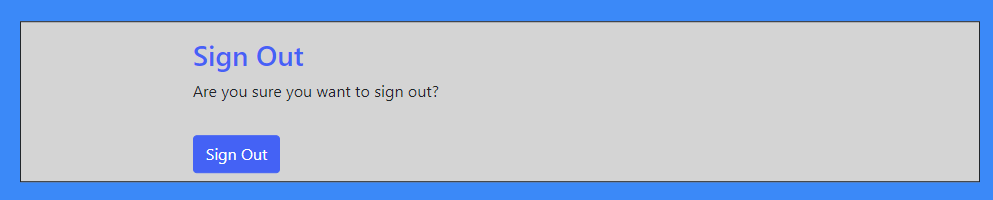

## [Table of Contents](#table-of-contents)
* [Purpose](#purpose)
* [User Experience Design (UX)](#user-experience-design)
* [User stories](#user-stories)
  * [Site Users](#site-users)
  * [Returning Visitor Goals](#returning-visitor-goals)
  * [Frequent Visitor Goals](#frequent-visitor-goals)
* [Agile Methodology](#agile-methodology)     
* [Design](#design)
  * [Wireframes](#wireframes)
  * [Colour Scheme](#color-scheme)
  * [Typography](#typography)
* [Structure](#structure)
  * [Logic](#logic)
* [Features](#features)
  * [Home Page](#home-page)
  * [Navigation](#navigation)
  * [Footer](#footer)
  * [Login/Logout/Register](#login-logout-register)  
  * [Make Booking](#make-booking)
  * [Delete Booking](#delete-booking)
  * [Edit Booking](#edit-booking)
  * [View Booking](#view-booking)
  * [Contact](#contact)
  * [Make Review](#make-review)
  * [View Review](#view-review)
* [Technologies](#technologies)
* [Testing](#testing)
  * [Manual Testing](#manual-testing)
  * [Bugs](#bugs)
* [Deployment](#deployment)
* [Credits](#credits)
   * [Code and Tutorials](#code-and-tutorials)
* [Acknoledgements](#acknowledgements)   
    

# TEAM | BUILD BOOKING SITE
## Purpose:
### Goal:
#### To allow individuals and organisations a place to book a 'Team Building' exercise for themselves and their organisation.
#### To provide a visual and interactive that the user will be able to fulfil their objectives.
This is a booking application for 'Team Building' exercises. It is a site where you and your team can book a day on one of the various team building activities. 
The company will then confirm your booking or call to get additional details and arrange payment.
The application was created with a real need in mind.

### Business Goals:

The main goal of this project is to give a user the ability to make bookings. User should also should also be able to make updates to their account in via their account.

### Target Audience:

The target audience are organisations who have group/groups that they feel would benefit from taking time out and learning to work in collaboration to solve various challenges.

* [Back to contents](#table-of-contents)

The live website can be found [here](https://andyk8872.github.io/project-2/).

## TEAM | BUILD  Responsive Website View

* [Back to contents](#table-of-contents)
*** 
## User Experience Design

### User stories
#### Site Users
* As a First Time user, I want to easily understand the main purpose of the site.
* As a first time user, I want to be able to play the game and participate in the experience.
* As a First Time user, I want to view the website and content clearly on my mobile device.
* As a Firt Time user, I want to find to be able to contact the site owners.
* As a user I can have the ability to request a callback before the visit so that I can give more information and receive information.
* As a user I can cancel my booking if I don't need it anymore.
* As a user I can edit my booking so that I can change time or give more information.
* As a user I can create an account so that I can see my bookings.
* As a user I can have confirmation checks in relation to deletion of my bookings.
* As a user I can see the various activity options to choose from.
#### Returning Visitor Goals
* As a Returning user, I want to enjoy the experience and the interactive options .
* As a Returning user, I want to contact the site owners so I can share my experience.
#### Frequent Visitor Goals
* As a Frequent user, I want to check to see if there are any changes.
* As a Frequent user, I want to check to see if there are any new updates.
#### Staff Memmber
* As a admin I can see what times have been booked so that I can plan my work.
* As a admin I can have contact details in relation to the customer.
* As a admin I can have the ability to confirm bookings.

* [Back to contents](#table-of-contents)
***

## Agile Methodology

### Github Project Board

* Although not specially designed for this the project board in github works well enabling me to track my user stories.
* This enabled me to manage the project by breaking it up into several phases.
*  Once the project had started it allowed me to cycle through the process to planning, executing and evaluating. 

### Project Board/User Stories:

User Stories:

 

* [Back to contents](#table-of-contents)
***
## Design
### Wireframes:

Desktop-Wireframes
 
* This is the 'home page' design in the desktop. 
 
* This is the 'contact page' design in the desktop. 
 
* This is the 'form' design. 
 
* This is the 'reviews/my-bookings' design. 
 

Mobile-Wireframes

* This is the 'home page' design in the mobile. 
 
* This is the 'contact page' design in the desktop. 

### Color Scheme:
The colors were chosen to complement each other as well as provide accessiblity. 
 

### Typography:
The Indie Flower and the Inknut Antiqua font are used throughout..

* [Back to contents](#table-of-contents)
***

## Structure
### Schema
### Logic
### ERD (diagrams)

* [Back to contents](#table-of-contents)
***

## Features

### Home Page
* The Home Page describes the site as a booking site and shows the three workshop challenges on offer.
 
***

### Navigation
* The Navigation bar gives the user the options/links in order to navigate the site and who is logged on if anyone.. 
 

***
### Footer
* The footer consists of two parts.
1. The social media links.
2. The copyright (using javascript for the current year) and a link to my Github page.
  

* [Back to contents](#table-of-contents)
***
### Login Logout Register
* The user can login, login and register with the site here. 
 
 
 

* [Back to contents](#table-of-contents)
***
### Make Booking
* This function allows the user to make a booking.
 

* [Back to contents](#table-of-contents)
***
### Delete Booking
* This function allows the user to delete a booking. 
 

* [Back to contents](#table-of-contents)
***
### Edit Booking
* This function allows the user to edit a booking. 
 

* [Back to contents](#table-of-contents)
***
### View Booking
* This function allows the user to view a booking. 
 

* [Back to contents](#table-of-contents)
***
### Make Review
* This function allows the user to make a review. 
 

* [Back to contents](#table-of-contents)
***
### View Review
* This function allows the user to view a review. 
 

* [Back to contents](#table-of-contents)
***
### Contact 
* The Contact option alows the user to contact the site owners.
* This is achieved through the backend.
* An Email delivery system platform (Mailtrap) is being used.

* This is the Contact Page. 
 
* This is the email sent to 'Mailtrap'. 
 
***

## Technogies Used

* [Back to contents](#table-of-contents)
***
## Testing

* [Back to contents](#table-of-contents)
***
## Deployment

* [Back to contents](#table-of-contents)
***

## Acknowledgements

* [Back to contents](#table-of-contents)
***
